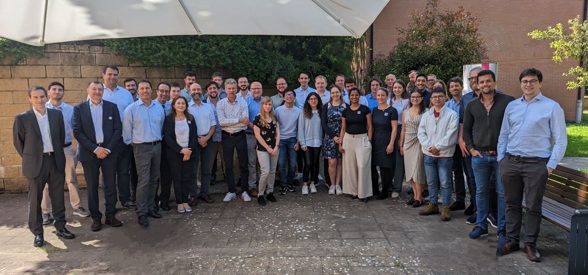
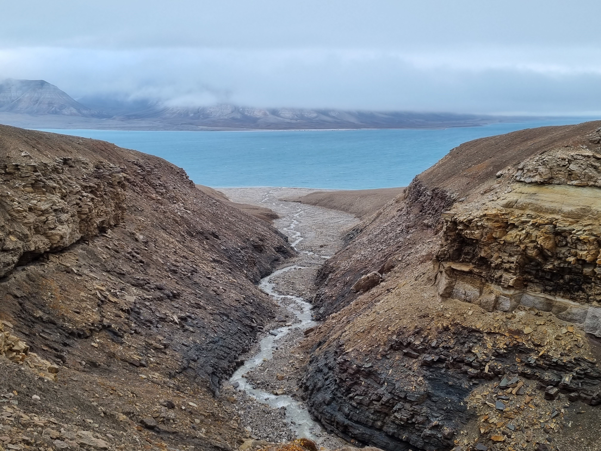
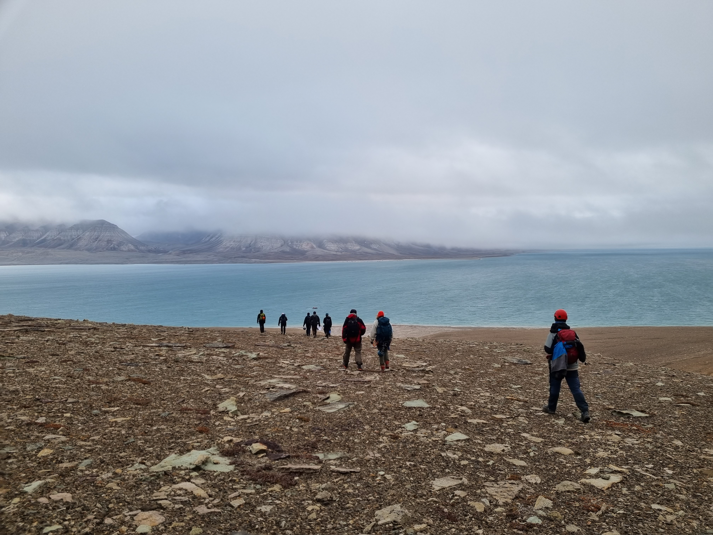
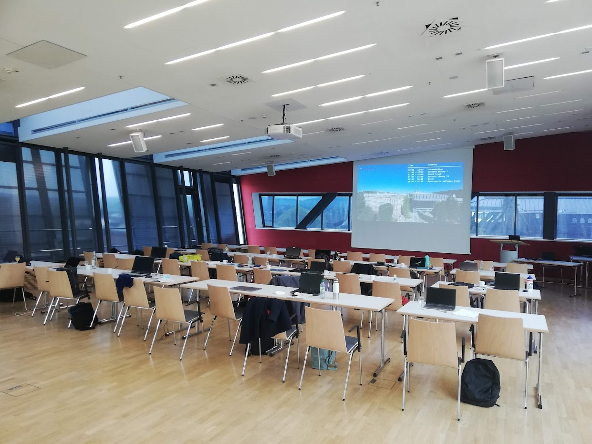
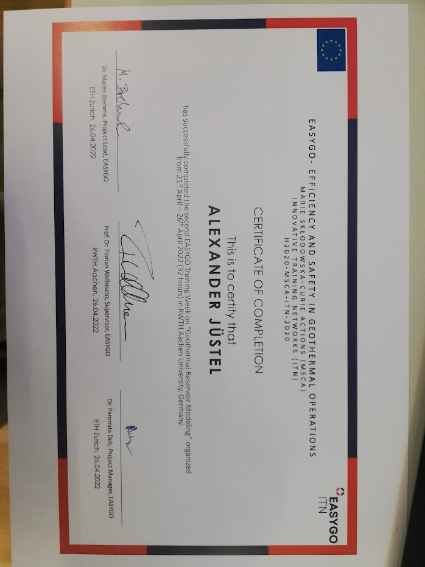
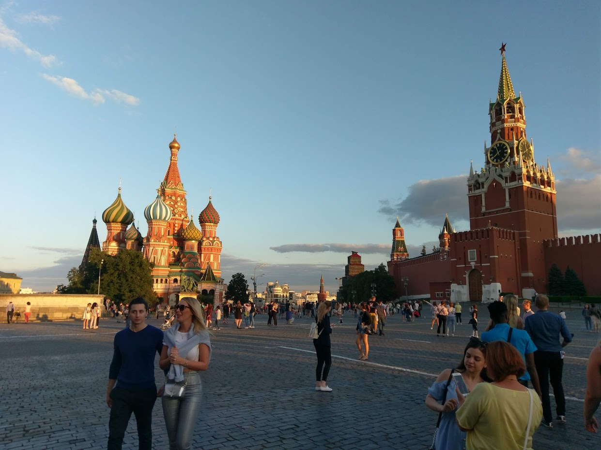
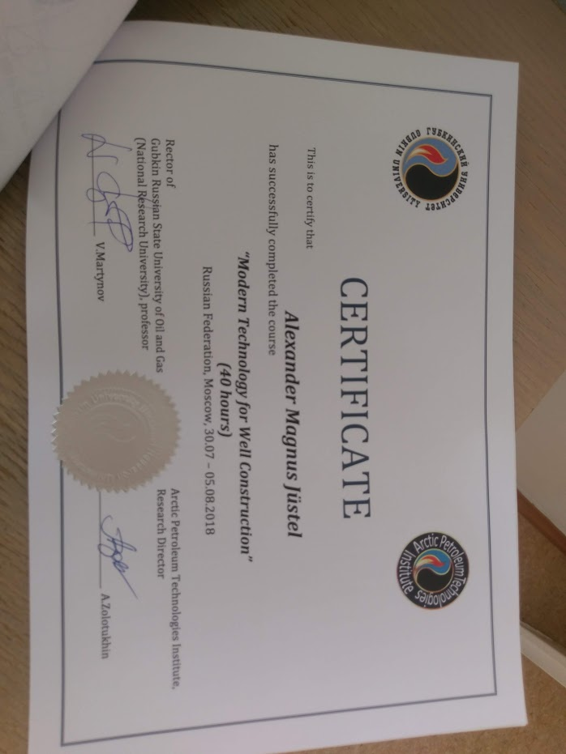
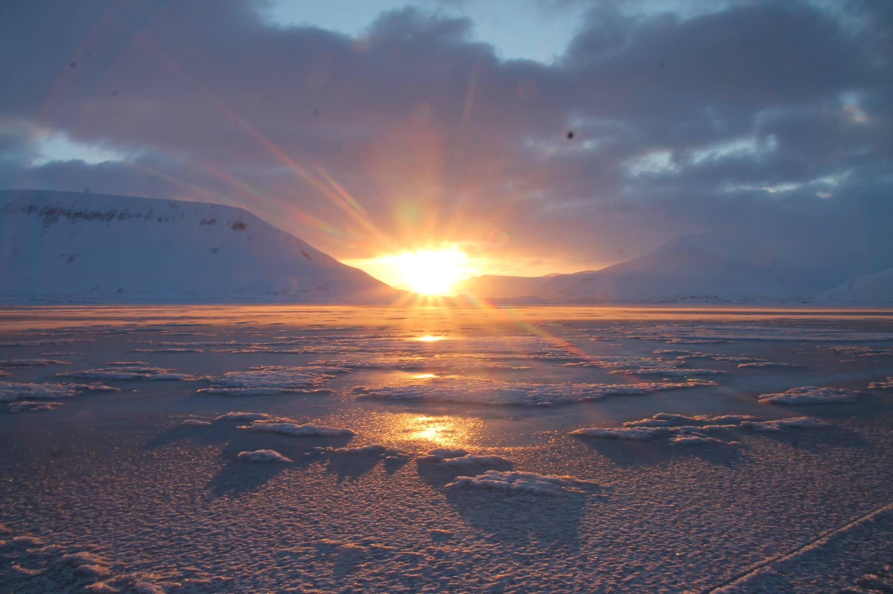
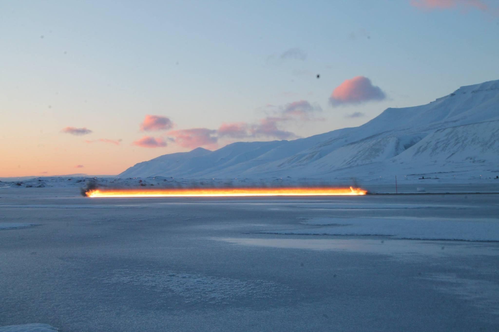
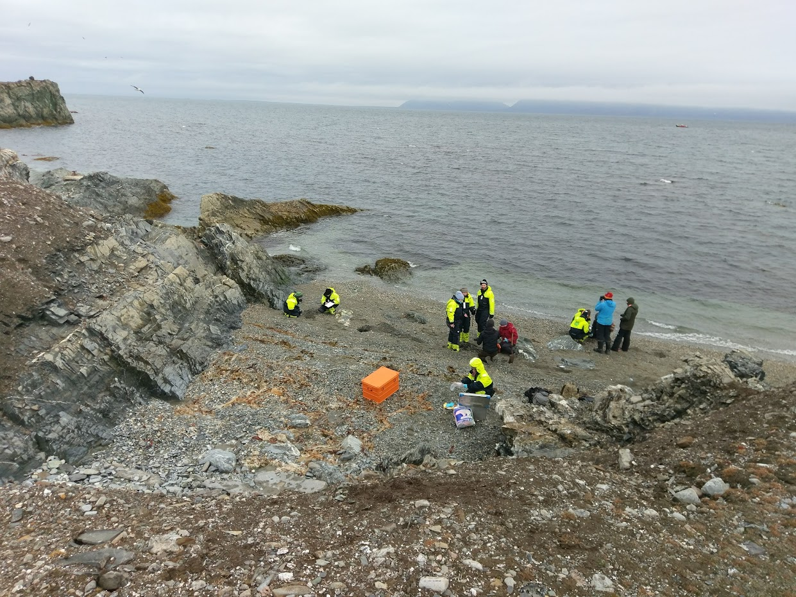

.. _academic_career_ref:

Academic Career
===============

* **06/2024 - present: Post-Doc at the** `Fraunhofer IEG, Fraunhofer Research Institution for Energy Infrastructures and Geotechnologies IEG<https://www.ieg.fraunhofer.de/>`_, **Aachen, Germany**

* **12/2021 - 06/2024: PhD Candidate at the** `Geological Institute <https://www.geol.rwth-aachen.de/>`_ **of the** `Faculty of Georesources and Materials Engineering <https://www.fb5.rwth-aachen.de/>`_ **at** `RWTH Aachen University <https://www.rwth-aachen.de/>`_, **Aachen, Germany**

    Supervisor: `Prof. Peter Kukla <https://www.rwth-aachen.de/go/id/bdfr/?gguid=0x39DAE8D9CE85D51196710000F4B4937D>`_, `Prof. Florian Wellmann <https://www.cg3.rwth-aachen.de/cms/cg3/der-lehrstuhl/team/~qpan/mitarbeiter-campus-/?gguid=PER-WF7GWHH&allou=1>`_, `Prof. Jonas Kley <https://www.uni-goettingen.de/en/410082.html>`_

    Topic: "Exploration and Characterization of Geothermal Reservoirs in North Rhine-Westphalia (NRW), Germany"

* **04/2018 - 08/2020: Graduate Student in** `Applied Geosciences (Energy and Mineral Resources) <https://www.rwth-aachen.de/cms/root/studium/Vor-dem-Studium/Studiengaenge/Liste-Aktuelle-Studiengaenge/Studiengangbeschreibung/~bnlc/Angewandte-Geowissenschaften-M-Sc-/?lidx=1>`_ **at** `RWTH Aachen University <https://www.rwth-aachen.de/>`_, **Aachen, Germany**

    Degree: Master of Science RWTH

    Supervisor: `Prof. Florian Wellmann <https://www.cg3.rwth-aachen.de/cms/cg3/Der-Lehrstuhl/Team/~qpan/Mitarbeiter-CAMPUS-/?gguid=0x5440F5A53D654C41874F09C577FE4005&allou=1>`_

    Topic: `"Increasing the knowledge base for deep geothermal energy exploration in the Aachen-Weisweiler area, Germany, through 3D probabilistic modeling with GemPy and quantitative data analysis" <https://publications.rwth-aachen.de/record/817438>`_

* **08/2016 - 07/2017: Erasmus Student in** `Geosciences (Master) <https://en.uit.no/education/program/270462/geosciences_-_master>`_ **at** `UiT The Arctic University of Norway <https://en.uit.no/startsida>`_, **Tromsø, Norway**

* **10/2013 - 08/2016: Undergraduate Student in** `Geosciences <https://www.uni-bonn.de/de/studium/studienangebot/studiengaenge-a-z/geowissenschaften-bsc>`_ **at** `Rheinische Friedrich-Wilhelms-Universität Bonn <https://www.uni-bonn.de/>`_, **Bonn, Germany**

    Degree: Bachelor of Science

    Supervisor: `Prof. Andreas Kemna <https://www.ifgeo.uni-bonn.de/de/abteilungen/geophysik>`_

    Topic: "Oberflächennahe Untersuchung der si7-Rutschung an der Dollendorfer Hardt bei Königswinter im Siebengebirge mit dem Bodenradar (GPR)"

* **08/2012 - 08/2013: High School Student at** `Ottoville Local School District <https://www.ottovilleschools.org/>`_, **Ottoville, OH, United States of America**

* **09/2004 - 06/2012:** `Luisenburg Gymnasium Wunsiedel <https://www.lugy.de/>`_, **Wunsiedel, Germany**

    Degree: Allgemeine Hochschulreife / General University Entrance Qualification

|

Courses and Summer Schools
==========================

* **05/2023: EASYGO 3rd Training Week in Volterra, Italy**

Source: https://www.gim.rwth-aachen.de/images/large/easygo_tw_2023_group_photo_all.jpg

|

* **08/2022 - 09/2022:** `AG-836 Rift Basin Reservoirs: From Outcrop to Model <https://www.unis.no/courses/ag-336-rift-basin-reservoirs-from-outcrop-to-model/>`_ **in Longyearbyen, Svalbard, Norway**

    Course Instructor: `Per Terje Osmundsen <https://www.unis.no/staff/per-terje-osmundsen/>`_

|pic1| |pic2|

|

* **04/2022: EASYGO 2nd Training Week in Aachen, Germany**

|pic3| |pic4|

|

* **07/2018 - 08/2018: Summer School Modern Technology for Well Construction at** `Gubkin Russian State University of Oil and Gas <https://en.gubkin.ru/>`_, **Moscow, Russia**

|pic5| |pic6|

* **02/2018 - 03/2018:** `AG-335 Arctic Seismic Exploration <https://www.unis.no/courses/ag-335-arctic-seismic-exploration/>`_ **in Longyearbyen, Svalbard, Norway**

    Course Instructor: `Tor Arne Johansen <https://www.unis.no/staff/tor-arne-johansen/>`_

|pic7| |pic8|

|

* **08/2017 - 09/2017:** `AT-333 Arctic Petroleum Sciences: Challenges for Society, Technology and Environment <https://www.unis.no/courses/at-333-arctic-petroleum-challenges-for-society-technology-and-environment/>`_ **in Longyearbyen, Svalbard, Norway**

    Course Instructor: `Helena Reinardy <https://www.unis.no/staff/helena-reinardy/>`_

|pic9| |pic10|

