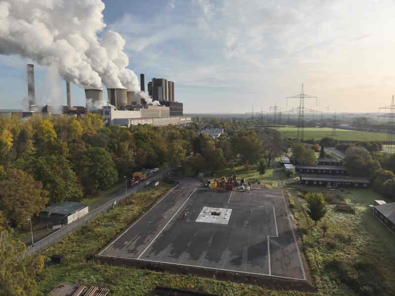
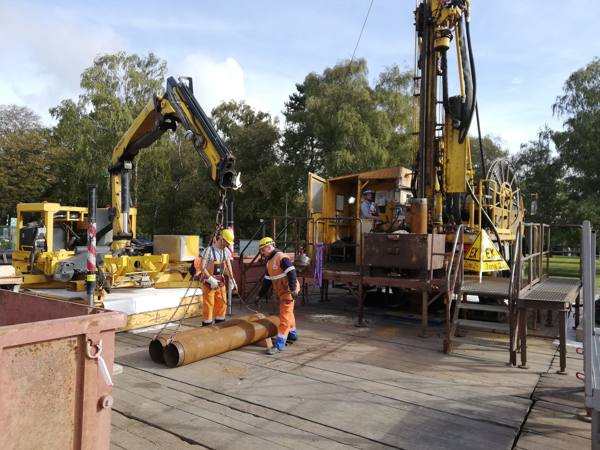

.. _fieldwork_ref:

Fieldwork
=========

* **02/2024 - 03/2024: Well Site Geologist for the EB2 borehole (500 m) at the Weisweiler drillsite**

    Tasks: Analysis and interpretation of cuttings and well logs from the Quaternary and Tertiary of the Weisweiler Horst of the Lower Rhine Embayment and Upper Carboniferous of the Aachen Fold-and-Thrust Belt (Inde Syncline) in cooperation with the Geological Survey of NRW, installation of a fibre optic cable for a seismic observatory

* **10/2023: Well Site Geologist for the EB1 borehole (100 m) at the Weisweiler drillsite**

    Tasks: Analysis and interpretation of cuttings and well logs from the Quaternary and Tertiary of the Weisweiler Horst of the Lower Rhine Embayment and Upper Carboniferous of the Aachen Fold-and-Thrust Belt (Inde Syncline) in cooperation with the Geological Survey of NRW, installation of a fibre optic cable for a seismic observatory

    More Information: https://www.ieg.fraunhofer.de/de/presse/pressemitteilungen/2023/Erste-Erkundungsbohrung-Weisweiler.html

|pic1| |pic2|

* **09/2023: Field Trip Deep geothermal energy systems for RWTH Aachen University (2 days)**

    Tasks: Field trip to the area of Stolberg looking at the Lower Carboniferous (Dinantian) Kohlenkalk carbonates and Upper Devonian Condroz sandstones as possible geothermal reservoir for the Aachen area. Acquisition of structural measurements and subsequent structural geological modeling using GemPy and geothermal potential estimation using DoubletCalc.

