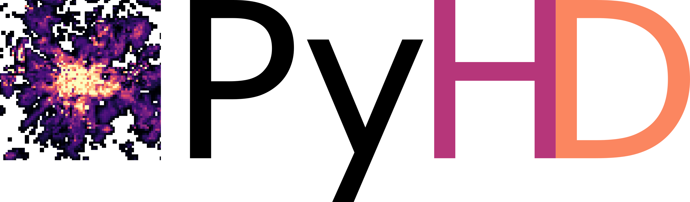

.. _open_source_ref:

Open-Source Contributions
=========================

During the time as PhD candidate, multiple open-source Python packages were developed.

These include the spatial data processing and subsurface toolbox **GemGIS**, the heat demand processing tool
**PyHeatDemand** and the borehole data processing tool **PyBorehole**.

With the engagement in the open-source software community, I am also a member of the `Software Underground <https://softwareunderground.org/>`_. You can find me on their `Mattermost Platform <https://mattermost.softwareunderground.org/swung>`_ under the handle @alexanderjuestel.
Further, I am supporting (and receiving great support from) the `pyOpenSci community <https://www.pyopensci.org/>`_. If you have questions regarding open-source Python packages, you can ping me on their `Slack Workspace <pyopensci.slack.com>`_ under the handle @Alexander Jüstel.

Resources
----------

* GemGIS
    * Repository: https://github.com/cgre-aachen/gemgis
    * Documentation: https://gemgis.readthedocs.io/
    * Publications: https://joss.theoj.org/papers/10.21105/joss.03709, https://jose.theoj.org/papers/10.21105/jose.00185
* PyHeatDemand
    * Repository: https://github.com/AlexanderJuestel/pyheatdemand
    * Documentation: https://pyhd.readthedocs.io/
    * Publication: N/A
* PyBorehole
    * Repository: https://github.com/AlexanderJuestel/pyborehole
    * Documentation: https://pyborehole.readthedocs.io/
    * Publication: N/A

|pic1| |pic2|

